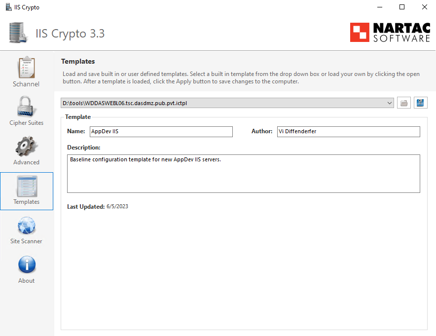
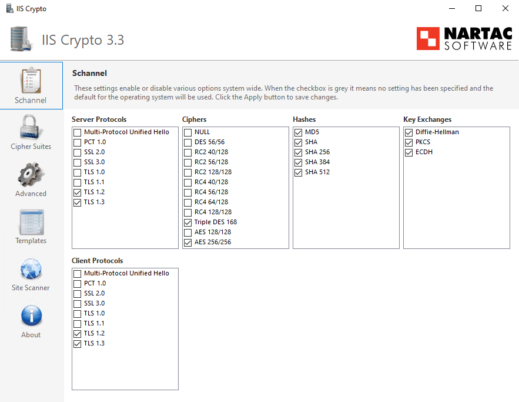
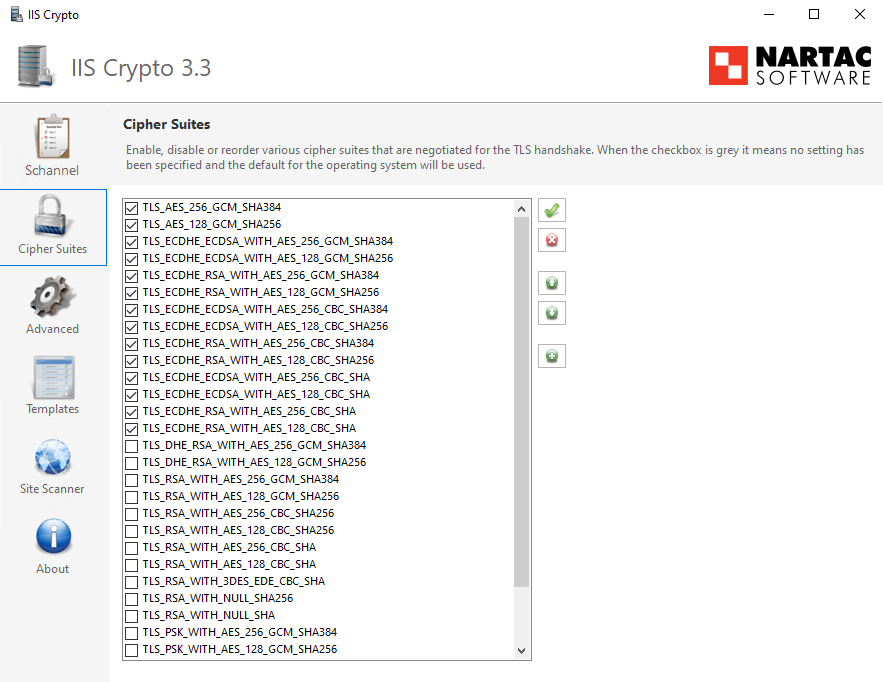
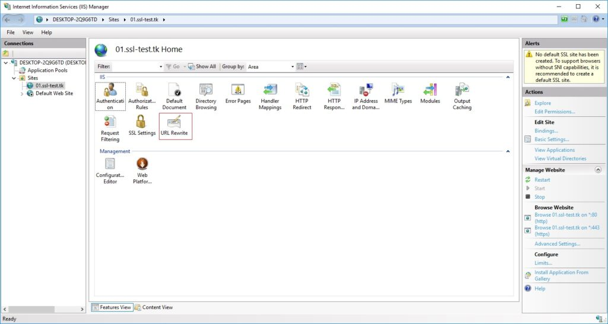
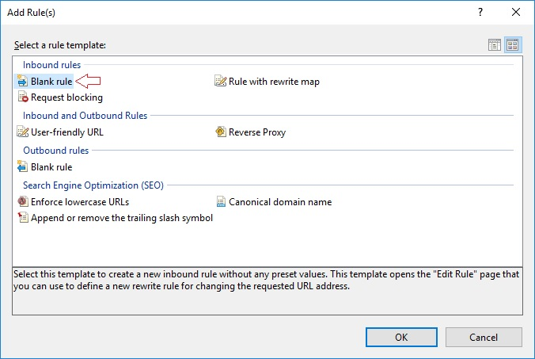
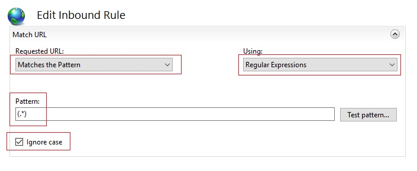

IIS Server Setup Instructions
=============================

EVERY configuration change needs to be documented so it can be repeated
EXACTLY on the test and prod servers. There cannot be any accidental
differences between the configuration of all the new servers (there may
be some explicit differences, but those differences will be documented).

Install IIS 10/Performance Monitor/Azure Monitoring Tools
---------------------------------------------------------

Install Azure Monitor Windows Agent

Setup gMSA Group
----------------

Submit a ticket to DCS for creating a gMSA account within the DMZ.

Created a security group of computer accts allowed to retrieve the
password so we can self manage as needed.

Name \-- AppDev gMSA Password Retrieval

Location \-- tsc.dasdmz.pub.pvt \> All Groups \> Global \> TSC Managed
Groups OU

Github Private Runner service account (tsc\\GHPR) setup

Networking/DNS
--------------

Make sure that websites can make requests to other websites on this
server.

Firewall Rules
--------------

Need to make sure web sites can make HTTP requests to other sites on
same server.

Mainframe (Tier specific)

159.121.108.40:3700 (Integration)

SQL Server (Tier specific)

10.107.129.170:2021 (Integration)

IIS Changes
===========

SSL Configuration
-----------------

Utilized IIS Crypto for the following configuration modifications:

{width="6.2723042432195975in"
height="4.831944444444445in"}

{width="6.248657042869641in"
height="4.833333333333333in"}

{width="6.5in" height="5.020383858267716in"}

1.  Ensure the following Registry key is set to\
    TLS\_AES\_256\_GCM\_SHA384

TLS\_AES\_128\_GCM\_SHA256

TLS\_ECDHE\_ECDSA\_WITH\_AES\_256\_GCM\_SHA384

TLS\_ECDHE\_ECDSA\_WITH\_AES\_128\_GCM\_SHA256\
TLS\_ECDHE\_RSA\_WITH\_AES\_256\_GCM\_SHA384\
TLS\_ECDHE\_RSA\_WITH\_AES\_128\_GCM\_SHA256\
TLS\_ECDHE\_ECDSA\_WITH\_AES\_256\_CBC\_SHA384\
TLS\_ECDHE\_ECDSA\_WITH\_AES\_128\_CBC\_SHA256\
TLS\_ECDHE\_RSA\_WITH\_AES\_256\_CBC\_SHA384\
TLS\_ECDHE\_RSA\_WITH\_AES\_128\_CBC\_SHA2\
TLS\_AES\_256\_GCM\_SHA384\
TLS\_AES\_128\_GCM\_SHA256\
56.\
HKLM\\SOFTWARE\\Policies\\Microsoft\\Cryptography\\Configuration\\SSL\\00010002:Func\
tions\
To verify using PowerShell enter the following command:\
Get-ItemProperty -path\
\'HKLM:\\SOFTWARE\\Policies\\Microsoft\\Cryptography\\Configuration\\SSL\\00010002\'
-\
name \'Functions\'

{width="6.5in"
height="6.752083333333333in"}

1.  Verify that SSLv2 is Disabled (CSS 7.2)

    a.  Ensure the key is set to 0 with powershell

        i.  Get-ItemProperty -path
            \'HKLM:\\SYSTEM\\CurrentControlSet\\Control\\SecurityProviders\\SCHANNEL\\Protocols\\SSL
            2.0\\Server\' -name \'Enabled\'

        ii. Get-ItemProperty -path
            \'HKLM:\\SYSTEM\\CurrentControlSet\\Control\\SecurityProviders\\SCHANNEL\\Protocols\\SSL
            2.0\\Client\' -name \'Enabled\'

    b.  Ensure the key is set to 1 with powershell

        i.  Get-ItemProperty -path
            \'HKLM:\\SYSTEM\\CurrentControlSet\\Control\\SecurityProviders\\SCHANNEL\\Protocols\\SSL
            2.0\\Server\' -name \'DisabledByDefault\'

        ii. Get-ItemProperty -path
            \'HKLM:\\SYSTEM\\CurrentControlSet\\Control\\SecurityProviders\\SCHANNEL\\Protocols\\SSL
            2.0\\Client\' -name \'DisabledByDefault\'

2.  Verify that SSLv3 is Disabled (CSS 7.3)

    a.  Ensure the key is set to 0 with powershell

        i.  Get-ItemProperty -path
            \'HKLM:\\SYSTEM\\CurrentControlSet\\Control\\SecurityProviders\\SCHANNEL\\Protocols\\SSL
            3.0\\Server\' -name \'Enabled\'

        ii. Get-ItemProperty -path
            \'HKLM:\\SYSTEM\\CurrentControlSet\\Control\\SecurityProviders\\SCHANNEL\\Protocols\\SSL
            3.0\\Client\' -name \'Enabled\'

    b.  Ensure the key is set to 1 with powershell

        i.  Get-ItemProperty -path
            \'HKLM:\\SYSTEM\\CurrentControlSet\\Control\\SecurityProviders\\SCHANNEL\\Protocols\\SSL
            3.0\\Server\' -name \'DisabledByDefault\'

        ii. Get-ItemProperty -path
            \'HKLM:\\SYSTEM\\CurrentControlSet\\Control\\SecurityProviders\\SCHANNEL\\Protocols\\SSL
            3.0\\Client\' -name \'DisabledByDefault\'

3.  Verify that TLS 1.0 is Disabled (CSS 7.4)

    a.  Ensure the key is set to 0 with powershell

        i.  Get-ItemProperty -path
            \'HKLM:\\SYSTEM\\CurrentControlSet\\Control\\SecurityProviders\\SCHANNEL\\Protocols\\TLS
            1.0\\Server\' -name \'Enabled\'

        ii. Get-ItemProperty -path
            \'HKLM:\\SYSTEM\\CurrentControlSet\\Control\\SecurityProviders\\SCHANNEL\\Protocols\\TLS
            1.0\\Client\' -name \'Enabled\'

    b.  Ensure the key is set to 1 with powershell

        i.  Get-ItemProperty -path
            \'HKLM:\\SYSTEM\\CurrentControlSet\\Control\\SecurityProviders\\SCHANNEL\\Protocols\\TLS
            1.0\\Server\' -name \'DisabledByDefault\'

        ii. Get-ItemProperty -path
            \'HKLM:\\SYSTEM\\CurrentControlSet\\Control\\SecurityProviders\\SCHANNEL\\Protocols\\TLS
            1.0\\Client\' -name \'DisabledByDefault\'

4.  Verify that TLS 1.1 is Disabled (CSS 7.5)

    a.  Ensure the key is set to 0 with powershell

        i.  Get-ItemProperty -path
            \'HKLM:\\SYSTEM\\CurrentControlSet\\Control\\SecurityProviders\\SCHANNEL\\Protocols\\TLS
            1.1\\Server\' -name \'Enabled\'

        ii. Get-ItemProperty -path
            \'HKLM:\\SYSTEM\\CurrentControlSet\\Control\\SecurityProviders\\SCHANNEL\\Protocols\\TLS
            1.1\\Client\' -name \'Enabled\'

    b.  Ensure the key is set to 1 with powershell

        i.  Get-ItemProperty -path
            \'HKLM:\\SYSTEM\\CurrentControlSet\\Control\\SecurityProviders\\SCHANNEL\\Protocols\\TLS
            1.1\\Server\' -name \'DisabledByDefault\'

        ii. Get-ItemProperty -path
            \'HKLM:\\SYSTEM\\CurrentControlSet\\Control\\SecurityProviders\\SCHANNEL\\Protocols\\TLS
            1.1\\Client\' -name \'DisabledByDefault\'

5.  Verify that TLS 1.2 is Enabled (CSS 7.6)

    a.  Ensure the key is set to 1 with powershell

        i.  Get-ItemProperty -path
            \'HKLM:\\SYSTEM\\CurrentControlSet\\Control\\SecurityProviders\\SCHANNEL\\Protocols\\TLS
            1.2\\Server\' -name \'Enabled\'

    b.  Ensure the key is set to 0 with powershell

        i.  Get-ItemProperty -path
            \'HKLM:\\SYSTEM\\CurrentControlSet\\Control\\SecurityProviders\\SCHANNEL\\Protocols\\TLS
            1.2\\Server\' -name \'DisabledByDefault\'

    c.  If the keys did not exist yet

        i.  New-Item
            \'HKLM:\\SYSTEM\\CurrentControlSet\\Control\\SecurityProviders\\SCHANNEL\\Protocols\\TLS
            1.2\\Server\' -Force \| Out-Null

        ii. New-ItemProperty -path
            \'HKLM:\\SYSTEM\\CurrentControlSet\\Control\\SecurityProviders\\SCHANNEL\\Protocols\\TLS
            1.2\\Server\' -name \'Enabled\' -value \'1\' -PropertyType
            \'DWord\' -Force \| Out-Null

        iii. New-ItemProperty -path
             \'HKLM:\\SYSTEM\\CurrentControlSet\\Control\\SecurityProviders\\SCHANNEL\\Protocols\\TLS
             1.2\\Server\' -name \'DisabledByDefault\' -value \'0\'
             -PropertyType \'DWord\' -Force \| Out-Null

6.  Ensure NULL Cipher Suite is Disabled (CSS 7.7)

    a.  Ensure that key is set to 0 with powershell

        i.  Get-ItemProperty -path
            \'HKLM:\\SYSTEM\\CurrentControlSet\\Control\\SecurityProviders\\SCHANNEL\\Ciphers\\NULL\'
            -name \'Enabled\'

7.  Ensure DES Cipher Suite is Disabled (CSS 7.8)

    a.  Ensure that key is set to 0 with powershell

        i.  Get-ItemProperty -path
            \'HKLM:\\SYSTEM\\CurrentControlSet\\Control\\SecurityProviders\\SCHANNEL\\Ciphers\\DES
            56/56\' -name \'Enabled\'

8.  Ensure RC4 Cipher Suits are Disabled (CSS 7.9)

    a.  Ensure that key is set to 0 with powershell

        i.  Get-ItemProperty -path
            \'HKLM:\\SYSTEM\\CurrentControlSet\\Control\\SecurityProviders\\SCHANNEL\\Ciphers\\RC4
            40/128\' -name \'Enabled\'

        ii. Get-ItemProperty -path
            \'HKLM:\\SYSTEM\\CurrentControlSet\\Control\\SecurityProviders\\SCHANNEL\\Ciphers\\RC4
            56/128\' -name \'Enabled\'

        iii. Get-ItemProperty -path
             \'HKLM:\\SYSTEM\\CurrentControlSet\\Control\\SecurityProviders\\SCHANNEL\\Ciphers\\RC4
             64/128\' -name \'Enabled\'

        iv. Get-ItemProperty -path
            \'HKLM:\\SYSTEM\\CurrentControlSet\\Control\\SecurityProviders\\SCHANNEL\\Ciphers\\RC4
            128/128\' -name \'Enabled\'

9.  Ensure AES 128/128 Cipher Suite is Disabled (CSS 7.10)

    a.  Ensure that key is set to 0 with powershell

        i.  Get-ItemProperty -path
            \'HKLM:\\SYSTEM\\CurrentControlSet\\Control\\SecurityProviders\\SCHANNEL\\Ciphers\\AES
            128/128\' -name \'Enabled\'

        ii. If not set to 0, use

> New-ItemProperty -path
> \'HKLM:\\SYSTEM\\CurrentControlSet\\Control\\SecurityProviders\\SCHANNEL\\Ciphers\\AES
> 128/128\' -name \'Enabled\' -value \'0\' -PropertyType \'DWord\'
> -Force \| Out-Null

10. Ensure AES 256/256 Cipher Suite is Enabled (CSS 7.11)

    a.  Ensure that key is set to 1 with powershell

        i.  Get-ItemProperty -path
            \'HKLM:\\SYSTEM\\CurrentControlSet\\Control\\SecurityProviders\\SCHANNEL\\Ciphers\\AES
            256/256\' -name \'Enabled\'

        ii. If set to very large number (but not 1) use

> New-ItemProperty -path
> \'HKLM:\\SYSTEM\\CurrentControlSet\\Control\\SecurityProviders\\SCHANNEL\\Ciphers\\AES
> 256/256\' -name \'Enabled\' -value \'1\' -PropertyType \'DWord\'
> -Force \| Out-Null

Server Configuration
--------------------

1.  Create D:\\web directory, this is where all websites will be placed
    (CSS 1.1)

2.  Install .NET Core Hosting Bundle 7.0.5

Needed for hosting .NET Applications

<https://learn.microsoft.com/en-us/aspnet/core/host-and-deploy/aspnet-core-module?view=aspnetcore-6.0>

3.  Install .NET Framework 4.7.2

> <https://dotnet.microsoft.com/en-us/download/dotnet-framework/net472>

4.  Install DB2 Runtime Client 11.5

> G:\\ADMN\\App AD
> Internal\\DBA\\Files\\drivers\\ibm\_data\_server\_runtime\_client\_win64\_v11.5.exe

5.  Import SSL Certs

> Install Digicert Certificate Utitlity For Windows on new server
>
> Open DigiCert Certificate Utility for Windows on server with existing
> SSL Certs
>
> Select desired cert and export to .pfx with private key. Make sure you
> don\'t lose your private key.
>
> Copy .pfx to desired server and use the DigiCert utility to import the
> .pfx using that password.
>
> Need to move over the latest dasapp.oregon.gov and dasapp.state.or.us
> wildcard certs

6.  Install URL Rewrite Module

> [URL Rewrite : The Official Microsoft IIS
> Site](https://www.iis.net/downloads/microsoft/url-rewrite)

7.  Install Application Initialization Module

> <https://learn.microsoft.com/en-us/iis/get-started/whats-new-in-iis-8/iis-80-application-initialization>
>
> Has details how to install the module, configuration of Default web
> site covered later in document, configuration of applications handled
> by automated deployment scripts.

Install Github Private Runner
-----------------------------

Reference Documentation:\
<https://docs.github.com/en/actions/hosting-your-own-runners/adding-self-hosted-runners>

At the Enterprise level in Github (OregonDASApps), click into Settings.

On the left pane, select Actions-\>Runners

Click New Runner

Start a powershell session as Administrator on the target IIS Server

Follow the Github instructions for the Windows x64 installation of the
runner (recommend putting the actions-runner directory on the D: drive
root) up to and including the ./config.cmd line. DO NOT RUN run.cmd as
instructed by github We want the runner to be a service

Use the following list as a guide for what values to enter during the
install script.

Press Enter to add to Default Runner Group

Press Enter to name the runner after the name of the server -
Name\_Of\_Server(Dev or Test or Prod)

Add the label (tier\_name-web-number) Example: integration-web-001

Press Enter for default work folder (\_work)

Press Y to run runner as a service

Press Enter to use Network Service as Account Runner

Open Services, browse to the Github Actions Runner service and change
the Log On Identity to tsc\\GHPR (leave password blank)

Restart Github Actions Runner service

Give full control to the C:\\Windows\\System32\\inetsrv\\config to the
service account used by the github runner. (You may get errors about the
Export and schema directories, but the important thing here is the
redirection and applicationHost configs).

Give the github service account full control to the D:\\Web folder

Open \'Edit local users and groups\' and add the Github service account
to the IIS\_IUSRS group

If the Github Actions Runner service won't start/shows the following
error:

{width="4.034722222222222in"
height="1.8840277777777779in"}

Initiate server reboot.

FTP Configuration
-----------------

There should be no FTP functionality of the server, but run through
these steps to be in compliance.

1.  Ensure FTP Requests are Encrypted (CSS 6.1)

    a.  Verify keys are set to SslRequire

        i.  Get-WebConfigurationProperty -pspath
            \'MACHINE/WEBROOT/APPHOST\' -filter
            \"system.applicationHost/sites/siteDefaults/ftpServer/security/ssl\"
            -name \"controlChannelPolicy\"

        ii. Get-WebConfigurationProperty -pspath
            \'MACHINE/WEBROOT/APPHOST\' -filter
            \"system.applicationHost/sites/siteDefaults/ftpServer/security/ssl\"
            -name \"dataChannelPolicy\"

2.  Ensure FTP Logon attempt restrictions are Enabled (CSS 6.2)

    a.  Verify value is set to true

> Get-WebConfigurationProperty -pspath \'MACHINE/WEBROOT/APPHOST\'
> -filter \"system.ftpServer/security/authentication/denyByFailure\"
> -name \"enabled\"

IIS Configuration
-----------------

### Server Level

1.  Configuration Manager

    1.  Set the ASPNETCORE\_ENVIRONMENT variable to the tier
        (Integration, Acceptance, or Production)

        i.  In the \"Section\" to the top left of the window,
            select system.webServer/aspNetCore in the dropdown

        ii. Mark environmentVariables line and click the tree dots at
            the end to edit the list.

        iii. Click the Add button and set
             the name to ASPNETCORE\_ENVIRONMENT and value to the
             correct tier Name Valid values are Integration or
             Acceptance or Production

        iv. Make sure you apply the changes and restart IIS

2.  Directory Browsing

    1.  Ensure that Directory Browsing is disabled (CSS 1.3)

        i.  Run as admin in powershell: Set-WebConfigurationProperty
            -Filter system.webserver/directorybrowse -PSPath iis:\\
            -Name Enabled -Value False

3.  WebDAV

    1.  Make sure WebDAV is not installed (CSS 1.7)

        i.  Run as admin in powershell: Uninstall-WindowsFeature
            Web-DAV-Publishing

4.  Authentication

    1.  Anonymous Authentication is "Enabled"

    2.  ASP.NET Impersonation is "Disabled"

    3.  Basic Authentication is "Disabled" (CSS 2.6) (CSS 2.7)

    4.  Forms Authentication is "Disabled" (CSS 2.7)

        i.  Check RequireSSL (CSS 2.3)

        ii. Change Mode to "Use Cookies" (CSS 2.4)

        iii. Change Protection Mode to "Encryption and Validation" (CSS
             2.5)

    5.  Windows Authentication is "Disabled"

5.  HTTP Response Headers

    1.  Set Strict-Transport-Security (CSS 7.1)

        i.  Add a header named 'Strict-Transport-Security' with a value
            of max-age=63072000; includeSubDomains;

        ii. Add a header named 'Referrer-Policy' with a value of
            'origin-when-cross-origin'

        iii. Add a header named 'Content-Security-Policy\' with a value
             of 'frame-ancestors \'none\';' (yes, none has single quotes
             and there is a semicolon)

        iv. Add a header named 'X-Frame-Options\' with a value of 'DENY'

    2.  Remove X-Powered-By header (CSS 3.11)

6.  Configure \"Request Filtering\":

    i.  Edit Feature Settings (Right Pane)

        1.  Allow Unlisted File Extensions -- UNCHECKED (CSS 4.7)

        2.  Allow Unlisted Verbs -- UNCHECKED (CSS 4.6)

        3.  Allow high-bit characters -- UNCHECKED (CSS 4.4)

        4.  Allow double escaping -- UNCHECKED (CSS 4.5)

        5.  Maximum allowed content length (Bytes) -- 10000000 (CSS 4.1)

        6.  Maximum URL length (Bytes) -- 2048 (CSS 4.2)

        7.  Maximum query string (Bytes) -- 2048 (CSS 4.3)

    ii. File Name Extensions Tab

        1.  Add ".", allowed set to "true"

        2.  Add ".png", allowed set to "true"

        3.  Add ".html", allowed set to "true"

        4.  Add ".htm", allowed set to "true"

        5.  Add ".ico", allowed set to "true"

        6.  Add ".css", allowed set to "true"

        7.  Add ".jpg", allowed set to "true"

        8.  Add ".js", allowed set to "true"

        9.  Add ".webmanifest", allowed set to "true"

        10. Add ".map", allowed set to "true"

        11. All other file extension set to "false"

    iii. Rules Tab

         1.  No Rules

    iv. Hidden Segments Tab

        1.  Confirm "web.config" listed (add if missing)

        2.  Confirm "bin" listed (add if missing)

        3.  Confirm "App\_code" listed (add if missing)

        4.  Confirm "App\_GlobalResources" listed (add if missing)

        5.  Confirm "App\_LocalResources" listed (add if missing)

        6.  Confirm "App\_WebReferences" listed (add if missing)

        7.  Confirm "App\_Data" listed (add if missing)

        8.  Confirm "App\_Browsers" listed (add if missing)

    v.  URL Tab

        1.  Confirm "./" is Deny (add if missing)

        2.  Confirm "\\" is Deny (add if missing)

        3.  Confirm "/fpdb/" is Deny (add if missing)

        4.  Confirm "/\_private" is Deny (add if missing)

        5.  Confirm "/\_vti\_pvt" is Deny (add if missing)

        6.  Confirm "/\_vti\_cnf" is Deny (add if missing)

        7.  Confirm "/\_vti\_txt" is Deny (add if missing)

        8.  Confirm "/\_vti\_log" is Deny (add if missing)

        9.  Confirm "/NUL." is Deny (add if missing)

        10. Confirm "/COM1." is Deny (add if missing)

        11. Confirm "/COM2." is Deny (add if missing)

        12. Confirm "/COM3." is Deny (add if missing)

        13. Confirm "/LPT1." is Deny (add if missing)

        14. Confirm "/LPT2." is Deny (add if missing)

        15. Confirm "/PRN." is Deny (add if missing)

        16. Confirm "/AUX." is Deny (add if missing)

    vi. HTTP Verbs Tab

        1.  "GET" is set to True

        2.  "HEAD" is set to True

        3.  "POST" is set to True

        4.  Remove "PUT"

        5.  "OPTIONS" is set to True

    vii. Headers Tab

         1.  No Headers

    viii. Query Strings Tab

          1.  No Query Strings

7.  Feature Delegation

    1.  .NET Trust Levels

        i.  Change to Read/Write

8.  .NET Trust Levels

    1.  Set server level default to Medium Trust (CSS 3.10)

9.  .NET Compilation (CSS 3.2)

    1.  On Development Server, Debug = True

    2.  On Acceptance and Productions Servers, Debug = False

10. Check Handler does not have Write and Script abilities (CSS 4.8)

    1.  Check with powershell

> Get-WebConfigurationProperty -pspath \'MACHINE/WEBROOT/APPHOST\'
> -filter \"system.webServer/handlers\" -name \"accessPolicy\"
>
> Should return Read,Script

11. Ensure notListedIsapisAllowed is false (CSS 4.9)

    1.  In the Connections pane on the left, select server to be
        configured\
        In Features View, select ISAPI and CGI Restrictions; in the
        Actions pane, select\
        Open Feature\
        In the Actions pane, select Edit Feature Settings\
        In the Edit ISAPI and CGI Restrictions Settings dialog, clear
        the Allow\
        unspecified ISAPI modules check box, if checked\
        Click OK

12. Ensure notListedCgisAllowed is false (CSS 4.10)

    1.  In the Connections pane on the left, select the server to
        configure\
        In Features View, select ISAPI and CGI Restrictions; in the
        Actions pane, select\
        Open Feature\
        In the Actions pane, select Edit Feature Settings\
        In the Edit ISAPI and CGI Restrictions Settings dialog, clear
        the Allow\
        unspecified CGI modules check box\
        Click OK

13. Ensure Dynamic IP Address Restrictions are Enabled (CSS 4.11)

    1.  Open IIS Manager.

    2.  Open the IP Address and Domain Restrictions feature.

    3.  Click Edit Dynamic Restrictions Settings..

    4.  Check the Deny IP Address based on the number of concurrent
        requests is checked

    5.  Set number of concurrent requests to 10

    6.  Check that Deny IP Address based on the number of requests over
        a period of time is checked

    7.  Set max number of requests to 20

    8.  Set Time Period to 200

14. Change default location of IIS files to restricted area (CSS 5.1)

    1.  Open Logging under Server

        i.  Set one log file per site

        ii. Set Log File for W3C format And selected Fields

> List all the fields to include here (including any custom ones)
>
> Custom Fields:
>
> Log Field - x-forwarded-for
>
> Source Type -- Request Header
>
> Source -- X-Forwarded-For

iii. Store log files in directory on a non-system, non-web app
     drive/partition

iv. UTF-8 encoding

v.  Set destination to Both Log File and ETW

vi. Set rollover to daily and use local time

```{=html}
<!-- -->
```
2.  {width="6.5in"
    height="2.9194444444444443in"}

3.  {width="5.46875in"
    height="5.926814304461942in"}

```{=html}
<!-- -->
```
15. Error Pages

    1.  Ensure IIS HTTP detailed errors hidden (CSS 3.44)

        i.  Edit Feature Settings and make sure "Detailed Errors for
            local requests and custom error pages for remote requests"

16. Session State

    1.  Ensure httpcookie for sessionstate (CSS 3.6)

        i.  In the Cookie Settings section, choose Use Cookies from the
            Mode dropdown

17. Machine Key (CSS 3.9)

    1.  Open IIS Manager and navigate to the level that was configured,
        the WEBROOT,\
        or server in this case

    2.  n the features view, double click Machine Key

    3.  On the Machine Key page, verify that HMACSHA256 is selected in
        the validation method dropdown

18. Remove Server Header (CSS 3.12)

Manager's Configuration Editor:

1.  {width="6.5in"
    height="2.363888888888889in"}Set removeServerHeader to True in IIS
    Configuration Manager requestFiltering node.

```{=html}
<!-- -->
```
19. IP Address and Domain Restrictions

    1.  For dev server (or any server that only allows internal access)

        i.  Click 'Edit Feature Settings'

            1.  Set Access for Unspecified Clients to 'Deny'

            2.  Set Deny Action Type to 'Forbidden'

        ii. Allow the Following Requestors

> {width="5.990418853893264in"
> height="5.156969597550306in"}

2.  For test and prod servers

    i.  Click 'Edit Feature Settings'

        1.  Set Access for Unspecified Clients to 'Allow'

    ii. Make sure no IP ranges are not allowed

```{=html}
<!-- -->
```
20. Deployment Method Retail (CSS 3.1)

    1.  On the Acceptance or Production Servers

        i.  Open the machine.config file located in:
            %systemroot%\\Microsoft.NET\\Framework\<bitness (if not the
            32 bit)\>\\\<framework version\>\\CONFIG

            1.  Check all the framework versions for CONFIG directories
                (only the v2 and v4 ones exist on dev)

        ii. Add the line \<deployment retail=\"true\" /\> within the
            \<system.web\> section

        iii. If systems are 64-bit, do the same for the machine.config
             located in: %systemroot%\\Microsoft.NET\\Framework\<bitness
             (if not the 32 bit)\>\\\<framework version\>\\CONFIG

             1.  Check all the framework versions for CONFIG directories
                 (only the v2 and v4 ones exist on dev)

### Application Pools

1.  Delete Default App Pools (CSS 1.4)

    a.  Remove .NET v2.0

    b.  Remove .NET v2.0 Classic

    c.  Remove .NET v4.5

    d.  Remove .NET v4.5 Classic

    e.  Remove Classic .NET AppPool

### Default Site Configuration

1.  Change Physical Path to D:\\Web\\default

2.  Copy standard "Site Retired Page" to D:\\Web\\default

3.  Confirm that\
    \<system.web\>

> \<httpCookies httpOnlyCookies=\"true\" requireSSL=\"true\" /\>
>
> \</system.web\>
>
> Is correctly inside the web.config file of the Default Site

4.  Set Bindings (Exception to CSS 1.2)

    a.  Bind http with no hostname to port 80 and All Unassigned IP
        Addresses

    b.  Bind https for \*.dasapp.state.or.us to port 443 for All
        Unassigned IP Addresses, check Require SNI and use correct
        wildcard dasapp.state.or.us SSL cert

    c.  Bind https for \*.dasapp.oregon.gov to port 443 for All
        Unassigned IP Addresses, check Require SNI and use correct
        wildcard dasapp.oregon.gov SSL cert

    d.  Bind https for port 443 for all Unassigned IP Addressed, no
        require SNI, use wildcard dasapp.oregon.gov cert

5.  Add URL Rewrite rule to forward http to https

> 1\. Select **URL Rewrite**

{width="6.5in"
height="3.4659722222222222in"}

2\. Click **Add Rules**

3.Select **Blank Rule**, click **OK**

{width="6.5in"
height="4.355555555555555in"}

4\. Enter the **Name of rule**

> 5\. In the Match URL section choose **"Matches the Pattern"** in the
> Requested URL drop-down
>
> 6\. Next select **"Regular Expressions"** in the Using drop-down

7\. In the Match URL section enter: "**(.\*)**"

{width="6.5in"
height="2.673611111111111in"}

> 8\. In the conditions section, select **Match All under Logical
> Grouping**, the click **Add**\
> 9. In the next window: 

a.  Enter** {HTTPS}** as the condition input

b.  Select **"Matches and Pattern"** from the drop-down

c.  Enter **\^OFF\$** as the pattern

d.  Click **OK**

{width="6.5in"
height="1.9840277777777777in"}

12\. In the Action section, click Redirect and then specify the Redirect
URL as: **https://{HTTP\_HOST}/{R:1}**

13.Check the Append Query String box

14\. Choose your redirection type **(301)**

{width="6.5in"
height="3.125in"}

a.  15\. Click **Apply**

### Site Configuration

1.  Put Site on non-system partition (CSS 1.1)

    a.  Handled by automated deployment script

2.  Ensure Host Header on site (CSS 1.2)

    a.  Correct header and bindings needs to be set up manually after
        first deployment, will hold values for subsequent values. Binds
        to SNI for all IP Addresses for port 443

3.  Ensure App Pool Identity set (CSS 1.4)

    a.  Handled by automated deployment script

4.  Ensure each site uses unique App Pool (CSS 1.5)

    a.  Handled by automated deployment script

5.  Ensure Anonymous Authentication uses App Pool Identity (CSS 1.6)

    a.  Handled by automated deployment script

6.  Configure Request Filtering

    a.  All changes from default server settings will be handled by
        deployment powershell scripts

7.  .NET Compilation

    a.  Deployments to Acceptance and Production will be compiled with
        Debug = false (CSS 3.2)

8.  Custom Error Messages (CSS 3.3)

    a.  Workflows for .NET applications will set customsErrors to 'On'
        for test and production tiers

    b.  The customErrors element is not used in .NET Core based apps

9.  No stack tracing enabled (CSS 3.5)

    a.  Tracing never used

10. Set HttpOnly for cookies (CSS 3.7)

    a.  Change configuration and use workflows to modify web.config to
        httpCookie element to have attributes httpOnlyCookies=\"true\"
        requireSSL=\"true\"

### Chosen Exceptions to CSS Recommendations

1.  Allow all users access to all sites (CSS 2.1, 2.2)

    a.  Access to the application is handled within the application.
        Because of DMZ restrictions, we cannot integrate AD users or
        groups with IIS security.

    b.  Azure App Proxy will be used to restrict all access to dev
        server.

2.  Allow debug on Development Server (CSS 3.2)

3.  Using HMACSHA256 (CSS 3.9) instead of SHA1 (CSS 3.8)

### Manual One-Time Configuration for New Apps

1.  Site Bindings

    a.  Bind HTTPS to all IP Addresses on 443

    b.  Enter FQDN for Host Name

    c.  Check Require Server Name Identification

    d.  Check 'Disable Legacy TLS', all other boxes should be unchecked

    e.  Select the correct SSL wildcard cert that matches the domain

Vulnerability Scan Results and Remediations
===========================================

July, 2023

Remediated\
Alternative Mitigation\
Unmitigated

+----------------------------------------------------------------------+
| 2.  Ensure \'Host headers\' are on all sites - host headers are on   |
|     all sites                                                        |
|                                                                      |
| Response to CSS: So, two bindings do not have host information at    |
| all and two have wildcards.  All four of these are for the Default   |
| Web Site which is just a generic "The application has been retired,  |
| please contact the help desk for questions" page so that basically   |
| anything hitting the site that isn't mapped to specific application  |
| with a host name hits the default site. Is there a better way to     |
| accomplish that goal that would comply with your benchmark?          |
|                                                                      |
| CSS Answer: Jason and I discussed this one and concluded that your   |
| solution (re-directing ambiguous requests to the default site)       |
| mitigates the concern at the CIS associates with this configuration  |
| item (i.e., inadvertently serving data to more domains than          |
| intended.)                                                           |
+======================================================================+
| 2.2 Ensure access to sensitive site features is restricted to        |
| authenticated principals only                                        |
|                                                                      |
| Response to CSS: Is there supposed to be more settings for anonymous |
| authentication?  Given that most modern MS web apps either have no   |
| authentication or are using MS Identity library (which uses SQL      |
| Server) or Azure AD (which allows the user to hit the site before    |
| trying to authenticate and doesn't integrate with IIS), this seems   |
| like an odd thing to flag.                                           |
|                                                                      |
| CSS Answer: Looking at the CIS Microsoft IIS 10 Benchmark            |
| documentation, under 2.2 the description, in part reads:             |
|                                                                      |
| *"Public servers/sites are typically configured to use Anonymous     |
| Authentication. This method typically works, provided the content or |
| services is intended for use by the public. When sites,              |
| applications, or specific content containers are not intended for    |
| anonymous public use, an appropriate authentication mechanism should |
| be utilized... It is recommended that sites containing sensitive     |
| information, confidential data, or non-public web services be        |
| configured with a credentials-based authentication mechanism."*      |
|                                                                      |
| The benchmark lists this as a manual check, so I suspect that the    |
| rationale for flagging it is simply to ensure that developers        |
| perform the manual check and make a determination based on the level |
| of risk that the application presents. If the application is         |
| intended for public use, then it sounds like, according to the CIS,  |
| anonymous authentication is acceptable.                              |
+----------------------------------------------------------------------+
| 3.1 Ensure \'deployment method retail\' is set                       |
|                                                                      |
| Because this is the dev server, retail mode is set to "false" to     |
| allow extra debugging functionality.                                 |
+----------------------------------------------------------------------+
| 3.10 Ensure global .NET trust level is configured - Applications     |
+----------------------------------------------------------------------+
| 3.7 Ensure \'cookies\' are set with HttpOnly attribute --            |
| Applications                                                         |
|                                                                      |
| Note -- this is handled inside the deployment scripts at the app     |
| level inside the WebAppTierSecuritySettings.yml action and not       |
| outlined in this document. Application Insights cookies are not set  |
| to HTTPOnly by default.                                              |
+----------------------------------------------------------------------+
| 3.7 Ensure \'cookies\' are set with HttpOnly attribute -- Default    |
|                                                                      |
| Fixed by hand in the default web application.                        |
+----------------------------------------------------------------------+
| 4.11 Ensure \'Dynamic IP Address Restrictions\' is enabled --        |
| maxConcurrentRequests                                                |
|                                                                      |
| Max Concurrent Requests limit is enabled at maximum set to 20        |
+----------------------------------------------------------------------+
| 4.6 Ensure \'HTTP Trace Method\' is disabled -- Applications         |
|                                                                      |
| Only GET, HEAD, POST, and OPTIONS are allowed at the server level    |
| and 'Allow Unlisted Verbs' is not checked. Individual applications   |
| may enable other methods if needed in workflow, but never TRACE      |
+----------------------------------------------------------------------+
| 4.6 Ensure \'HTTP Trace Method\' is disabled -- Default              |
|                                                                      |
| Only GET, HEAD, POST, and OPTIONS are allowed at the server level    |
| and 'Allow Unlisted Verbs' is not checked.                           |
+----------------------------------------------------------------------+
| 4.8 Ensure Handler is not granted Write and Script/Execute --        |
| Applications                                                         |
|                                                                      |
| Handler granted Read,Script at server level, not specified in        |
| web,config files                                                     |
+----------------------------------------------------------------------+
| 5.2 Ensure Advanced IIS logging is enabled                           |
|                                                                      |
| Logging is enabled and multiple fields have been selected.           |
+----------------------------------------------------------------------+
| 5.3 Ensure \'ETW Logging\' is enabled                                |
|                                                                      |
| Change Made                                                          |
+----------------------------------------------------------------------+
| 5.3 Ensure \'ETW Logging\' is enabled - Sites logFormat W3C with ETW |
| target                                                               |
|                                                                      |
| Change Made                                                          |
+----------------------------------------------------------------------+
| 7.6 Ensure TLS 1.2 is Enabled                                        |
|                                                                      |
| Change Made with powershell                                          |
+----------------------------------------------------------------------+
